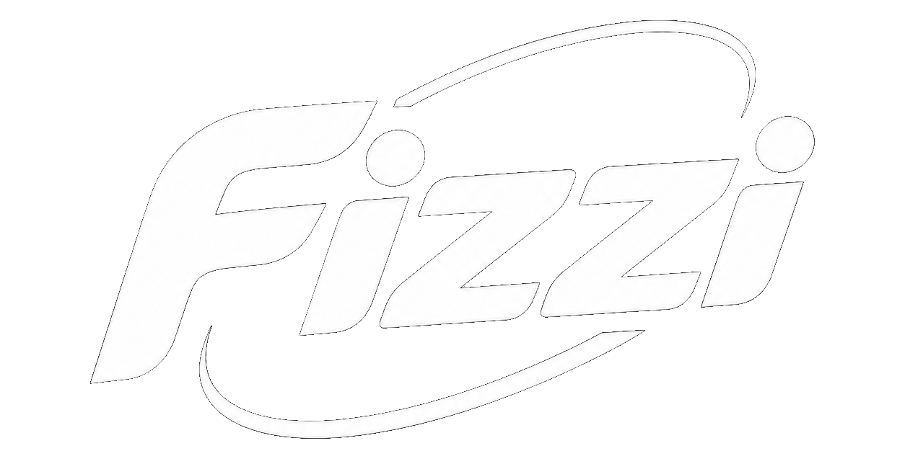
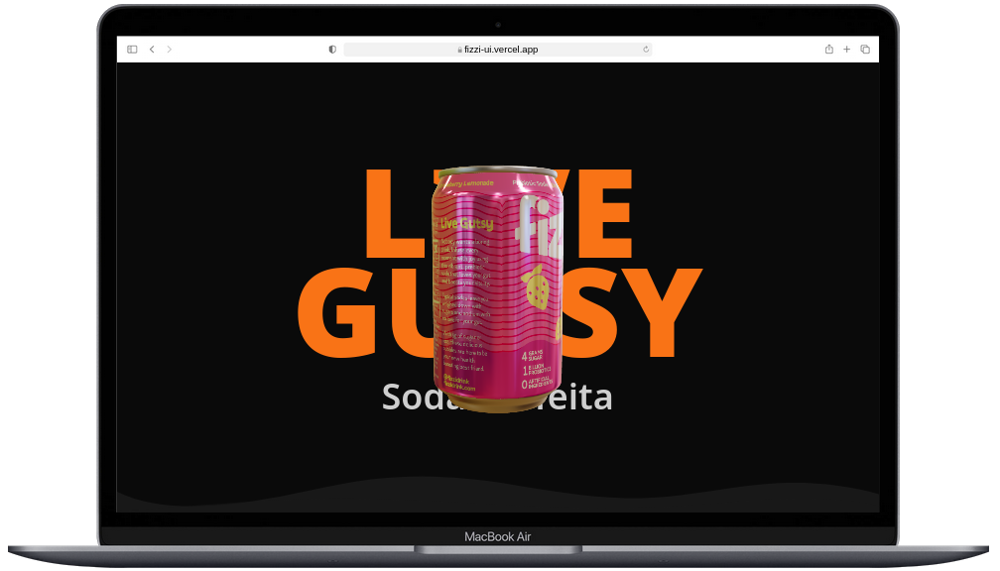

<div align="center">
   
  </br> </br>
  
  [](https://github.com/Adyllsxn/fizzi-ui)
  [](https://fizzi-ui.vercel.app)
  [](LICENSE)

</div>

---

## **📖 SOBRE O PROJETO**

> **Fizzi** é uma experiência visual interativa em 3D desenvolvida com Next.js e Three.js. O projeto explora animações em tempo real, renderização de modelos 3D e efeitos visuais imersivos, inspirado no universo de marcas de refrigerante.

### **✨ Funcionalidades:**
```markdown
✅ Modelo 3D interativo de lata de refrigerante
✅ Troca de sabores com mudança de textura e cor de fundo
✅ Controles de câmera (zoom, rotação, auto-rotação)
✅ Efeito de partículas (Sparkles) e iluminação HDR
✅ Interface moderna com glassmorphism e backdrop blur
✅ Animações suaves com GSAP
✅ Design responsivo e gradientes dinâmicos
```
---

## **🛠️ TECNOLOGIAS**

| Camada | Tecnologias |
|--------|-------------|
| **Runtime** | Next.js, TypeScript |
| **3D** | Three.js, React Three Fiber, React Three Drei |
| **Estilização** | Tailwind CSS, Tailwind Merge |
| **Animações** | GSAP |
| **Deploy** | Vercel |

---

## 📸 DEMO
<div align="center">  <br /> <i>Interface principal</i> </div>

---

## **PRÉ-REQUISITOS**

Antes de começar, certifique-se de ter atendido aos seguintes requisitos:

* [Git](https://git-scm.com/downloads "Download Git") deve estar instalado no seu sistema operacional.

### Executar Localmente

Para executar o **Foodie** localmente, execute este comando no seu git bash:


```bash
# Clone o repositório
git clone https://github.com/Adyllsxn/fizzi-ui.git

# Entre na pasta
cd fizzi-ui/website

# Instale as dependências
npm install

# Rode o projeto
npm run dev
```
> Local http://localhost:3000 

> Remoto https://fizzi-ui.vercel.app/

--- 

## **📌 CRÉDITOS**

Inspirado no projeto [Fizzi](https://github.com/prismicio-community/course-fizzi-next) de [prismicio-community](https://github.com/prismicio-community)

---

## **📄 LICENÇA**

> Este projeto está sob a licença **MIT**. Isso significa que você pode usar, copiar, modificar, mesclar, publicar, distribuir, sublicenciar e/ou vender cópias do software, desde que mantenha o aviso de copyright original.

---

> ⚠️ Aviso: Os modelos 3D e texturas são de uso demonstrativo. Para uso comercial, adquira as licenças adequadas. Este projeto não possui afiliação oficial com a marca original.

